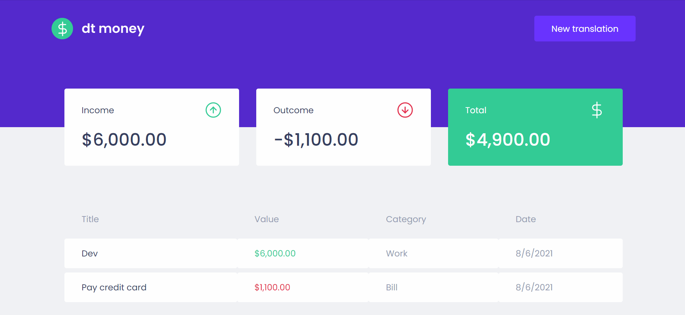

<h1 align="center" title="Podcastr">
		
		Dt Money
</h1>

<h2 align="center">Podcastr is a platform for listening to podcasts about development 🚀</h2>

<h4 align="center">
 <a href="#-features-developed-during-the-course">💻 Features</a> •
 <a href="#-technologies-used">🛠 Technologies</a> • 
 <a href="#books-what-i-learn">:books: What I learn</a> 
 <a href="#-how-to-run-the-project">🔨 How to run the project</a> • 
 <a href="#star2-thanks">:star2: Thanks</a> • 
</h4>

<br>



<h2 align="center"> 
	<a href="https://dt-money-nine.vercel.app/">View Demo</a>
</h2>

## 💻 Features

- [x] Add new transaction with title, value, type and category
- [x] List all transactions
- [x] Summary with income, outcome and total of transactions
- [x] Change total card background to green if transactions is positive or to red if transactions is negative

## 🛠 Technologies Used

- [React](https://pt-br.reactjs.org/)
- [TypeScript](https://www.typescriptlang.org/)
- [Styled Components](https://styled-components.com/)
- [Mirage.js](https://miragejs.com/)

## :books: What I learn

- How to use Context
- How create a custom hook
- How use mirage.js to create a fake api
- How use the styled-components

## 🔨 How to run the project

```bash
# Clone this repository
$ git clone https://github.com/tl-lucasestevam/dt-money

# Access the project folder
$ cd dt-money

# Install the dependencies
$ yarn 

# Run the application in development mode
$ yarn start

```

## **:star2: Thanks!**

<div align=center>
  <table style="width:100%">
    <tr align=center>
      <td>
        <a href="https://rocketseat.com.br/">
          
        </a>
        <p>
          Rocketseat
        </p>
      </td>
      <td>
        <a href="https://github.com/diego3g">
          
        </a>
        <p>
          Diego3g
        </p>
      </td>
    </tr>
  </table>
</div>

<h4 align="center">
	Make with ❤️ by <a href="https://github.com/tl-lucasestevam">Lucas Estevam</a>
</h4>
